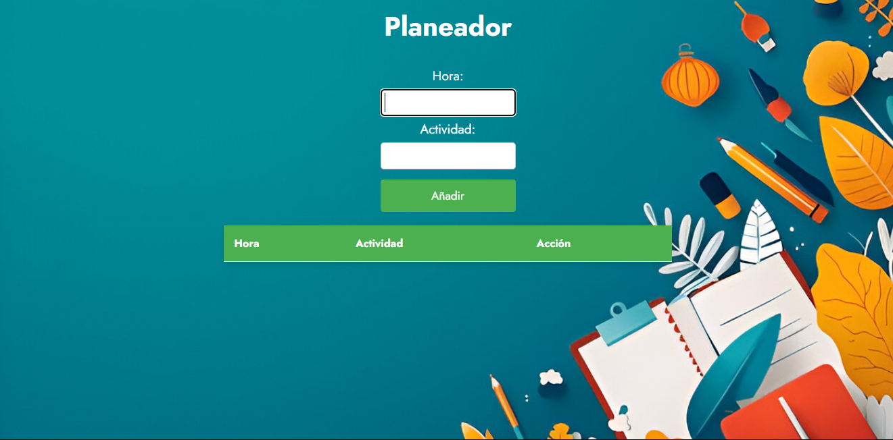
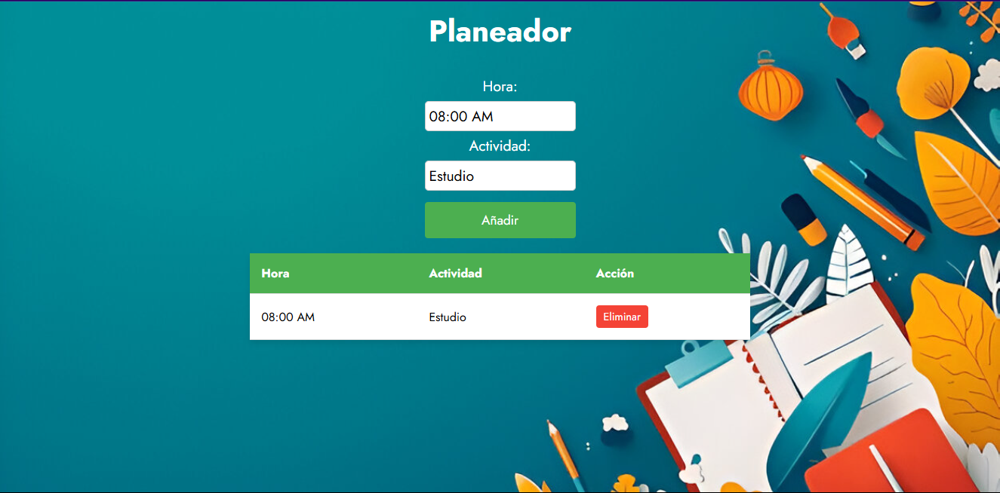
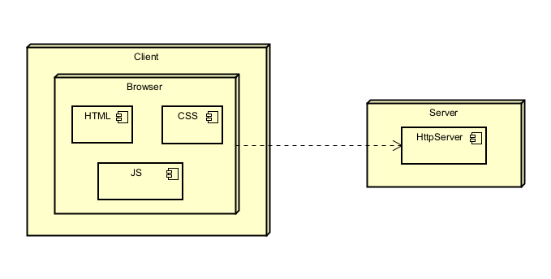
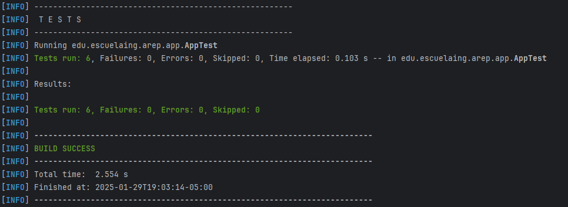

# Simple Web Server

This project implements a simple web server that provides static files to build a web application and uses a REST 
service for its functionality. 

## Getting Started

### Prerequisites

### 1. **Java Development Kit (JDK)**

- To check if Java is installed, run:

  ```
    java -version
  ```
  
- If Java is not installed, download it from the official Oracle [website](https://www.oracle.com/co/java/technologies/downloads/).

### 2. **Maven**

- To check if Maven is installed, run:

```
    mvn --version
```

- If Maven is not installed, download it from the official Apache Maven [website](https://maven.apache.org/download.cgi).

### 3. Git

- To check if Git is installed, run:

```
    git --version
```

- If Git is not installed, download it from the official Git [website](https://git-scm.com/downloads).

### Installing

1. Clone the repository to your local machine using Git.

```
    git clone https://github.com/SamuRoj/AREP_Taller_1.git
```

2. Navigate to the project directory.

```
    cd AREP_Taller_1
```

3. Build the project by running the following command.

```
    mvn clean install
```

4. Execute the project with Maven.

```
    java -cp target/taller-1-1.0-SNAPSHOT.jar edu.escuelaing.arep.app.HttpServer
```

5. Once the server is running, open your web browser and visit:

```
    http://localhost:23727
```

- This is the startup page where the user can plan his daily activities, you just need to fill the time and activity 
input and click the add button to add to the web page table.



- After the activity has been added you can delete or keep adding more. 



## Architecture

### Deployment Diagram



### Overview

This diagram summarized the interactions between the client and the HttpServer implementation.

### Components

- **HTML:** It is served through the HTTP server and allows the browser to render the web page.
- **CSS:** It is also served from the server and is responsible for styling the page.
- **JS:** It is served from the server and handles GET, POST, and DELETE requests to refresh the activity list on the page, 
while also keeping the server updated on any changes made.
- **HTTP Server:** It is responsible for serving the files requested by the client and processing the GET, POST, and DELETE 
requests it receives.

## Running the tests

- Execute them by running the following command:

```
    mvn test
```

- Image of the results:



## Built With

* [Java Development Kit](https://www.oracle.com/co/java/technologies/downloads/) - Software Toolkit
* [Maven](https://maven.apache.org/) - Dependency Management
* [Git](https://git-scm.com/) - Distributed Version Control System

## Authors

* **Samuel Rojas** - [SamuRoj](https://github.com/SamuRoj)

## License

This project is licensed under the GNU License - see the [LICENSE.md](LICENSE.md) file for details.